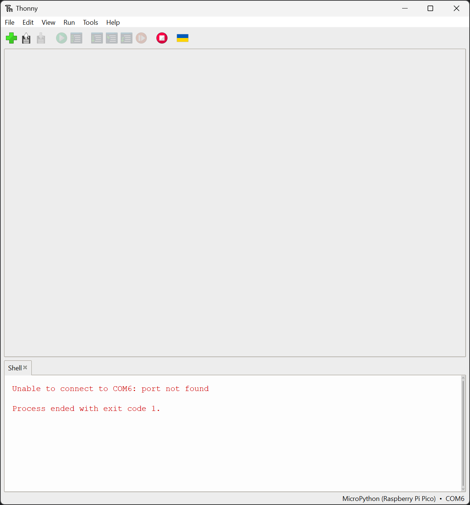
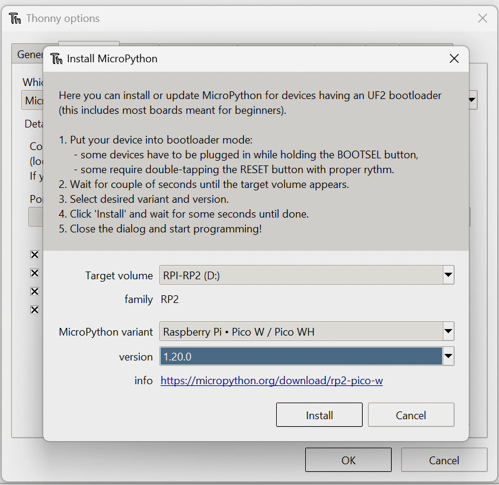
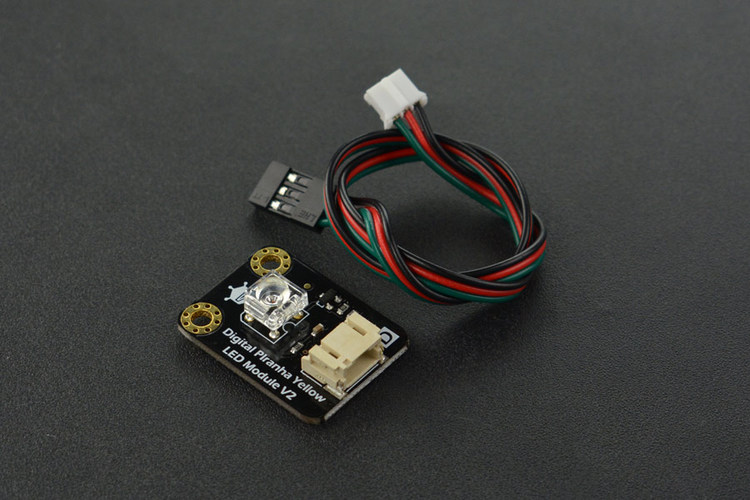
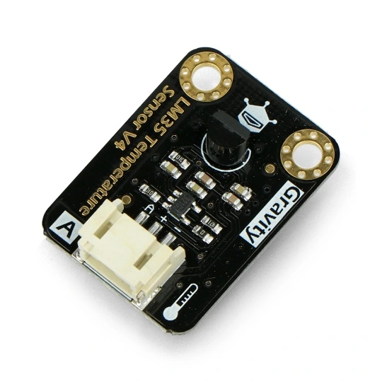
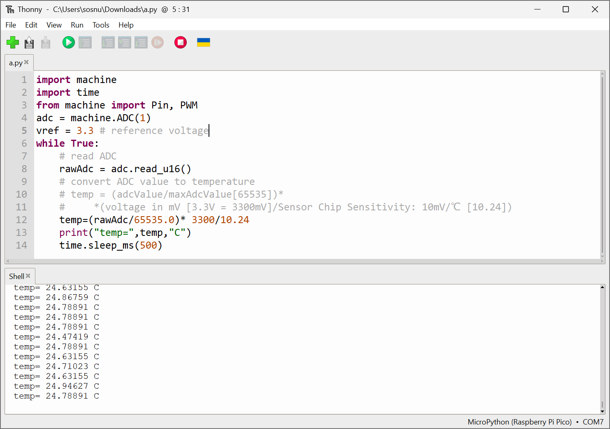
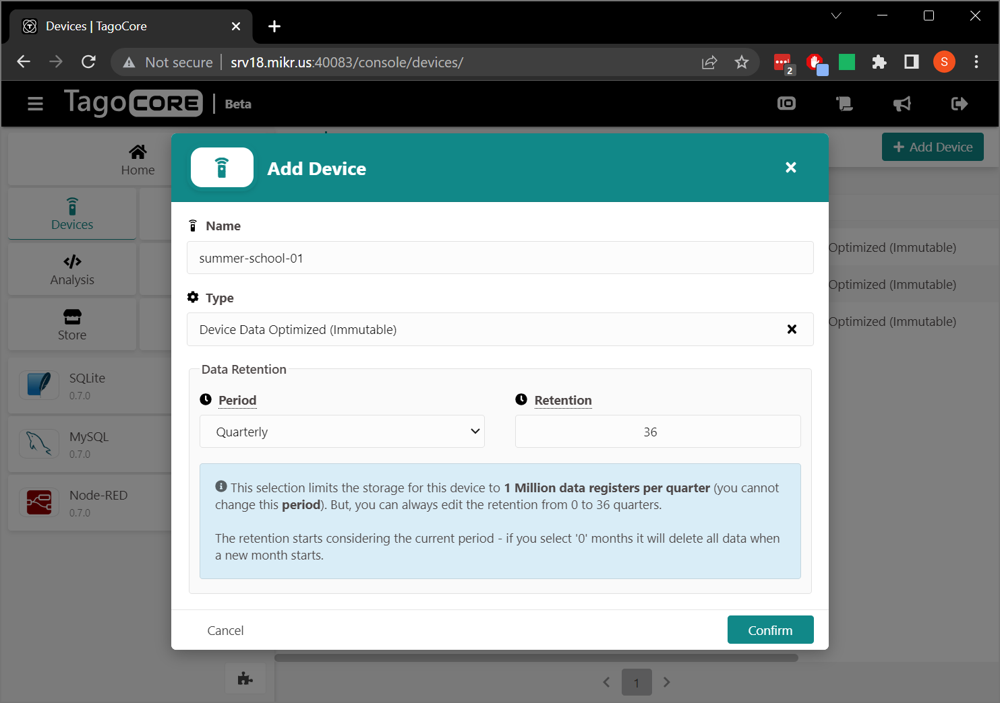
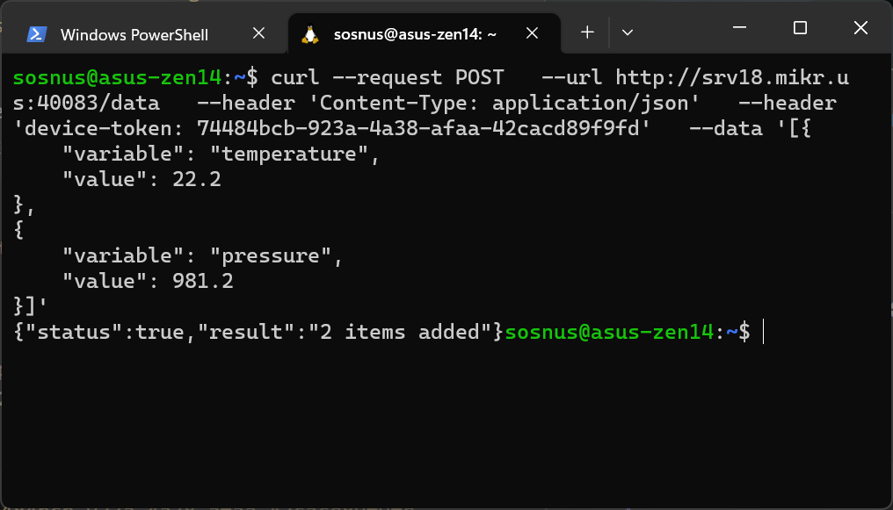
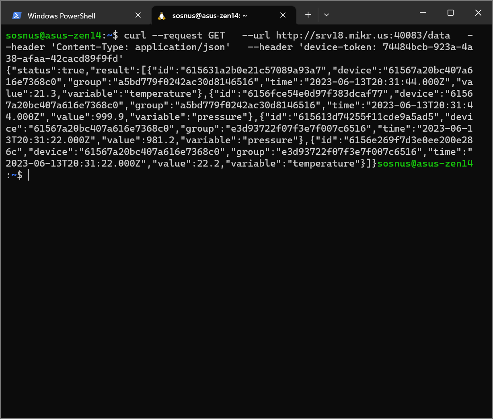

# Workshop
## Before You start
1. Do You have installed Thonny IDE (simplest way to develop project using Rpi Pico and Python)?
    * If not, follow this tutorial: https://projects.raspberrypi.org/en/projects/get-started-pico-w/0
2. Your Thonny IDE working with Rpi Pico W? You can deploy Your file written in Python to Pico W?
    * If not, follow this tutorial: https://projects.raspberrypi.org/en/projects/get-started-pico-w/1
3. Could You connect Rpi Pico to WiFI network?
    * If not, follow this tutorial: https://projects.raspberrypi.org/en/projects/get-started-pico-w/2 and ask about WiFI credentials

## Part 1: First step with RPi Pico nad sensors
### Install bootloader
Steps:
1. Run `Thonny IDE`



2. Plug in `RPi Pico WH` to computer via cable USB micro
3. Open `Tools`>`Options...`


4. Click `Install or update MicroPython`


5. Read instruction and select newest, stable version of bootloader



6. Click `Install`
7. After a lot of seconds we see label `Done`. Now we must close all windows of Thonny and back to main window of this IDE
8. Open `Tools`>`Options...` one more time - now You see new Port COM on `Port` list:


9. Select this new port and press `OK`
10. If everything is OK, You can see in console this text:
```
MicroPython v1.20.0 on 2023-04-26; Raspberry Pi Pico W with RP2040

Type "help()" for more information.

>>> 
```
 

11. It is time to connect everything together. Connect `Rpi Pico WH` with DFRobot shield, then connect led module to pin `GP2` (first headers on left side of board)


> ❗❗❗`REMEMBER!`
> ```
> ADC0 is on GP26 PIN
> ADC1 is on GP27 PIN
> ADC2 is on GP28 PIN
> ```
> <br>
12. Now we can write first program. Click on `+` ("Plus") symbol on top left corner of IDE
13. Paste this snippet into editor:
```Python
from machine import Pin
led = Pin(2, Pin.OUT) # we use GP2, becouse it is first port on headers
import time 
while True: 
  led.value(1) 
  time.sleep_ms(500) 
  led.value(0) 
  time.sleep_ms(500)
```

14. And click `RUN` symbol:


15. Led shoud blink with interval 0,5 seconds. If everything works, we can move on to the sensors.

16. Connect sensor to `RPi Pico WH`. In this sample project, we use `DFRobot Analog Ambient Light Sensor V2.1` - sensor should be connect to pin `GP27`



17. Paste this simple program to `Thonny IDE`, save file and press `RUN` symbol
``` Python
import machine
import time
from machine import Pin, PWM
adc = machine.ADC(1)
vref = 3.3 # reference voltage
while True:
    # read ADC
    rawAdc = adc.read_u16()
    # convert ADC value to temperature
    # temp = (adcValue/maxAdcValue[65535])*
    #     *(voltage in mV [3.3V = 3300mV]/Sensor Chip Sensitivity: 10mV/℃ [10.24])
    temp=(rawAdc/65535.0)* 3300/10.24
    print("temp=",temp,"C")
    time.sleep_ms(500)
```

18. In shell You can see value from temperature sensor


19. Now You can try use another digital or analog sensor!

## Part 2: Network connection and send data to Tago Core
During first part we learn how to run program using `Thonny IDE` and how to read data from sensors. Now it is time to send data to the cloud!

### Part 2 a: Send data to Tago Core (from console)
You can communicate with service `Tago Core` using REST API. If You want send data to cloud, You need only two variables:
1. `server address`
2. `token`

Only `Tago Core` administrator can add, change or remove devices. Ask about Your credentials (token) during workshop. The training instructor will create the device for you and provide You with access data.


If You receive credentials, You can test connection using console program `cURL`, but how to prepare request?

`Tago Core` receives and returns data in `JSON` format. It is array with one or more variables. Fields `variable` and `value`.
* `variable` should be `String`
* `value` could be `Int`, `Float` or `String`
* OPTIONAL: `timestamp` - `Int` - if You do not add this parameter, server use current timestamp value. 

EXAMPLE: If You want send data about temperature and pressure, You can send `JSON` object like this:
``` JSON
[{
    "variable": "temperature",
    "value": 22.2
},
{
    "variable": "pressure",
    "value": 981.2
}]
```
You have `token`: `74484bcb-923a-4a38-afaa-42cacd89f9fd`
and `address`: `http://srv18.mikr.us:40083/data` from `Tago Core` administrator.
You can build `cURL` request:
``` Bash
curl --request POST \
  --url http://srv18.mikr.us:40083/data \
  --header 'Content-Type: application/json' \
  --header 'device-token: 74484bcb-923a-4a38-afaa-42cacd89f9fd' \
  --data '[{
    "variable": "temperature",
    "value": 22.2
},
{
    "variable": "pressure",
    "value": 981.2
}]'
```
This request could be send from console using `cURL`:

We receive response:
``` Bash
{
	"status": true,
	"result": "2 items added"
}
```
So `Tago Core` write our 2 variables to database.

`IMPORTANT!` If You do not have `cURL` on Your computer, You can use cURL online, for example: `https://reqbin.com/curl`

Now we can read Our data using `GET` request:
``` Bash
curl --request GET \
  --url http://srv18.mikr.us:40083/data \
  --header 'Content-Type: application/json' \
  --header 'device-token: 74484bcb-923a-4a38-afaa-42cacd89f9fd'
```

In console this message is very hard to read, but If we format this like JSON, we can see:
``` JSON
{
	"status": true,
	"result": [
		{
			"id": "615631a2b0e21c57089a93a7",
			"device": "61567a20bc407a616e7368c0",
			"group": "a5bd779f0242ac30d8146516",
			"time": "2023-06-13T20:31:44.000Z",
			"value": 21.3,
			"variable": "temperature"
		},
		{
			"id": "6156fce54e0d97f383dcaf77",
			"device": "61567a20bc407a616e7368c0",
			"group": "a5bd779f0242ac30d8146516",
			"time": "2023-06-13T20:31:44.000Z",
			"value": 999.9,
			"variable": "pressure"
		},
		{
			"id": "615613d74255f11cde9a5ad5",
			"device": "61567a20bc407a616e7368c0",
			"group": "e3d93722f07f3e7f007c6516",
			"time": "2023-06-13T20:31:22.000Z",
			"value": 981.2,
			"variable": "pressure"
		},
		{
			"id": "6156e269f7d3e0ee200e286c",
			"device": "61567a20bc407a616e7368c0",
			"group": "e3d93722f07f3e7f007c6516",
			"time": "2023-06-13T20:31:22.000Z",
			"value": 22.2,
			"variable": "temperature"
		}
	]
}
```
`Tago Core` add a lot of metadata to our variables:
* `id` - unique ID of this object
* `device` - unique Id of device (in HEX)
* `group` - metadata, not important for us
* `time` - time, when this object was written
* `value` - value of variable
* `variable` - name of variable

We will deal with data processing later, now it's time to do it using `Raspberry Pico WH`

## Part 2 b: Send data to Tago Core (from Rpi Pico)?
We know how to use `RPi Pico WH` and how to do request to `Tago Core` REST API - it is time to merge this! But first, we need connect our device to WiFi network and test connection.

There is simplest way to test WiFi connection and access to Internet:
> ❗❗❗`REMEMBER!` - replace this strings with Your credentials
> ```
> ssid = "YOUR-WIFI-SSID"
> password = "YOUR-WIFI-PASSWORD"
> ```
> <br>
``` Python
import network
import time
import urequests as requests

# GLOBAL_VARIABLES
ssid = "YOUR-WIFI-SSID"
password = "YOUR-WIFI-PASSWORD"

wlan = None

def init():
    wlan = network.WLAN(network.STA_IF)
    connect_to_wifi(wlan,ssid, password)
    
def loop():
    while True:
        r = requests.get("https://raw.githubusercontent.com/sosnus/rpi-pico/main/workshops/docs/misc/api-test.txt")
        print("Response: ")
        print(r.text)
        r.close() # important!!! Without it Our program should do not work correctly
        print("WAIT...")
        time.sleep_ms(3000)
      
def connect_to_wifi(wlan = None, ssid = "", password = ""):
    wlan.active(True)
    wlan.connect(ssid, password)
    while wlan.isconnected() == False:
        print('Waiting for connection...')
        time.sleep_ms(1000)
    print("WiFi "+ ssid + " connected!")
    
init()
loop()
```

In previous part we learn how to send data to Tago using cURL, now we do same thing, but from `Raspberry Pi Pico WH` using `MicroPython` script. So If we want execute this request:
``` Bash
curl --request POST \
  --url http://srv18.mikr.us:40083/data \
  --header 'Content-Type: application/json' \
  --header 'device-token: 74484bcb-923a-4a38-afaa-42cacd89f9fd' \
  --data '[{
    "variable": "temperature",
    "value": 22.2
},
{
    "variable": "pressure",
    "value": 981.2
}]'
```

Using `MicroPython`, we can use this code:

``` Python
import network
import socket
import time
from machine import Pin
import machine
import urequests as requests

# GLOBAL_VARIABLES
ssid = "YOUR-WIFI-SSID"
password = "YOUR-WIFI-PASSWORD"

wlan = None

def init():
    wlan = network.WLAN(network.STA_IF)
    connect_to_wifi(wlan,ssid, password)
    
def loop():
    while True:
        url = "http://srv18.mikr.us:40083/data"

        payload = [
            {
                "variable": "temperatureEmulator",
                "value": 22.2
            }
        ]
        headers = {
            "Content-Type": "application/json",
            "device-token": "74484bcb-923a-4a38-afaa-42cacd89f9fd"
        }

        r = requests.request("POST", url, json=payload, headers=headers)

        print("Response: ")
        print(r.text)
        r.close() # important!!!
        print("WAIT...")
        time.sleep_ms(3000)
      
def connect_to_wifi(wlan = None, ssid = "", password = ""):
    wlan.active(True)
    wlan.connect(ssid, password)
    while wlan.isconnected() == False:
        print('Waiting for connection...')
        time.sleep_ms(1000)
    print("WiFi "+ ssid + " connected!")
    
init()
loop()
```

Then we can add real sensor, and replace `payload` field from previous code with value from temperature sensor. Pay attention to line codes after lines `# NEW!!! description`:

``` Python
import network
import socket
import urequests as requests
import machine
import time
from machine import Pin, PWM
# NEW!!! Sensor initialization
adc = machine.ADC(0)

# GLOBAL_VARIABLES
ssid = "YOUR-WIFI-SSID"
password = "YOUR-WIFI-PASSWORD"

wlan = None

def init():
    wlan = network.WLAN(network.STA_IF)
    connect_to_wifi(wlan,ssid, password)
    
def loop():
    while True:
        # NEW!!! Here we read data from sensor
        rawAdc = adc.read_u16()
        temp=(rawAdc/65535.0)* 3300/10.24
        print("temp=",temp,"C")
        
        
        url = "http://srv18.mikr.us:40083/data"

        # NEW!!! variable temp is used inside payload
        payload = [
            {
                "variable": "temperatureEmulator",
                "value": temp
            }
        ]
        headers = {
            "Content-Type": "application/json",
            "device-token": "74484bcb-923a-4a38-afaa-42cacd89f9fd"
        }

        r = requests.request("POST", url, json=payload, headers=headers)

        print("Response: ")
        print(r.text)
        r.close() # important!!!
        print("WAIT...")
        time.sleep_ms(3000)
      
def connect_to_wifi(wlan = None, ssid = "", password = ""):
    wlan.active(True)
    wlan.connect(ssid, password)
    while wlan.isconnected() == False:
        print('Waiting for connection...')
        time.sleep_ms(1000)
    print("WiFi "+ ssid + " connected!")
    
init()
loop()
```


// TODO:!!!!!!!!!!!!!!!!!!!!!!!!!!!!!!!!!!!!!!!


### This is the end...
Thank You for take part in this workshop, now You have some time to think about Smart Building Hackathon, there are a lot of auxiliary questions, and sample responses:
* What do you want to check/measure?
    * temperature
    * humidity
    * human presence
* What sensors You can use?
    * LM35
    * BME280
    * PIR Sensor
* What is the best way to visualize it?
    * Table
    * Line chart, Bar chart
    * Text messages (Discord Bot?)


### How to read data from Tago Core?

#### Read data from Tago Core using Grafana


#### Read data from Tago Core using Rest API
https://help.tago.io/portal/en/kb/articles/36-getting-data
https://help.tago.io/portal/en/kb/articles/31-api-overview