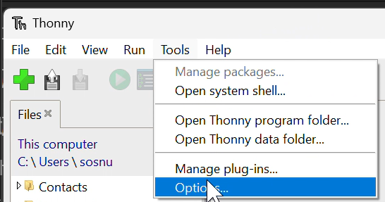
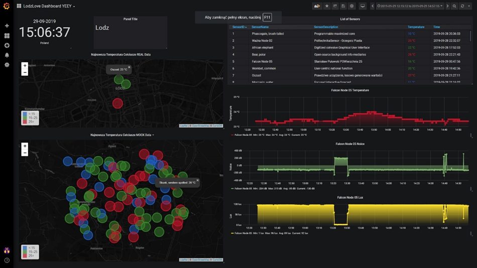
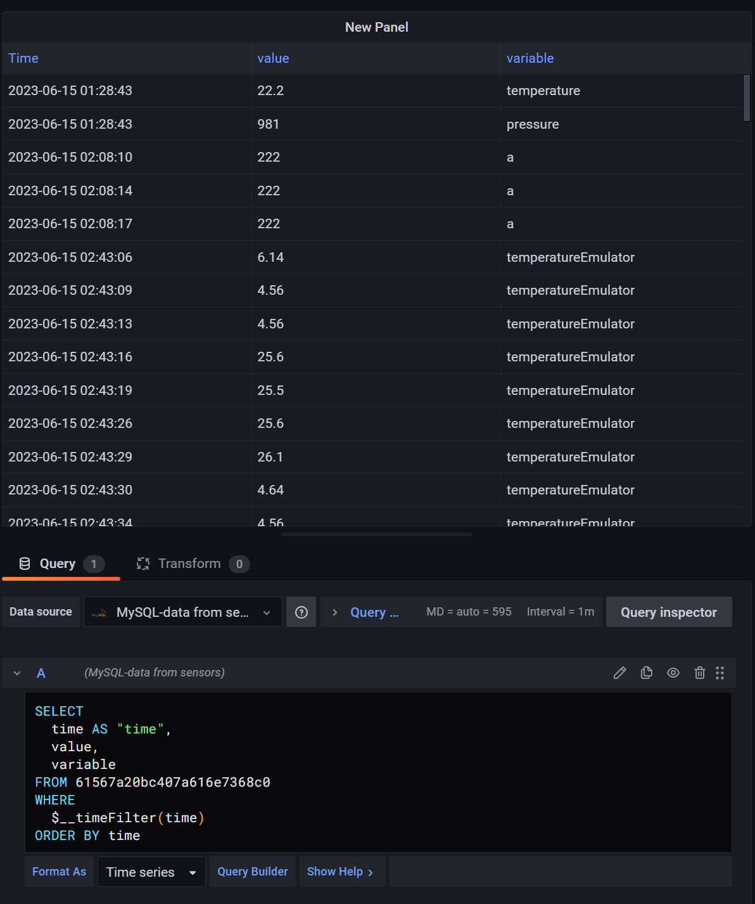
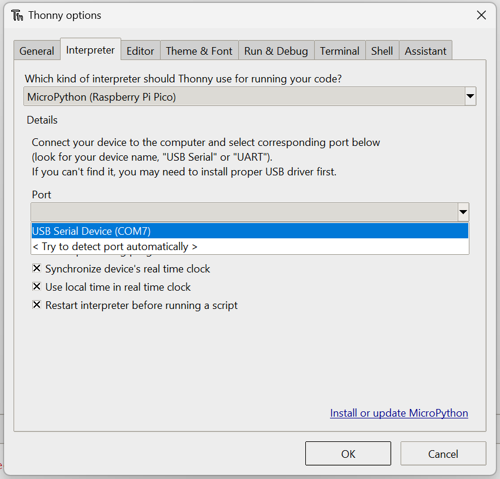
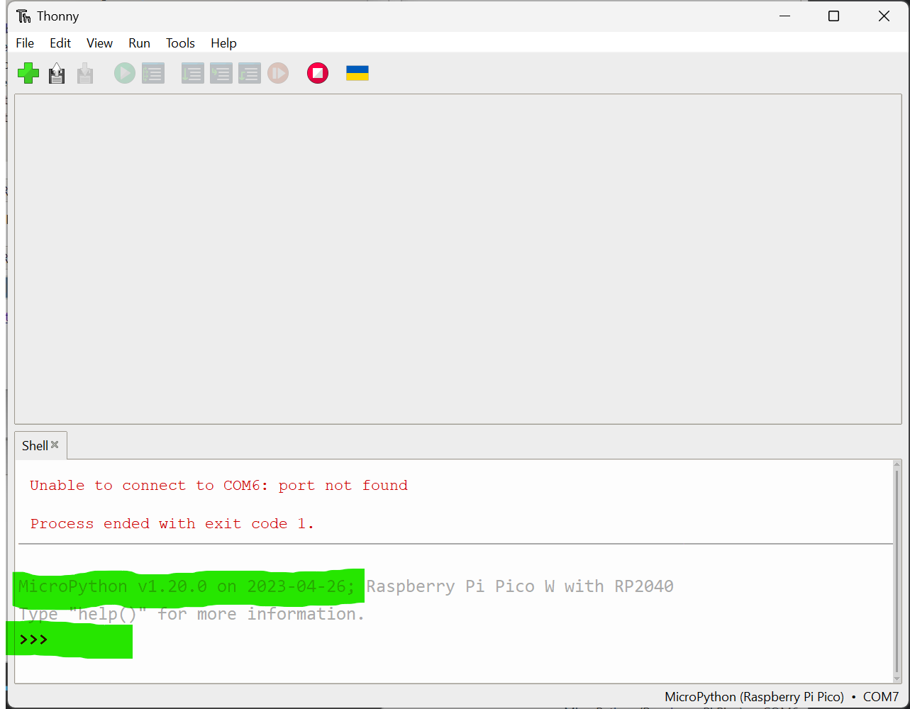
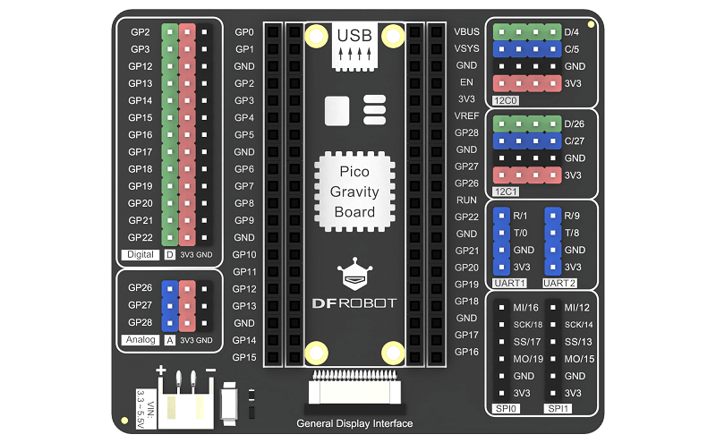
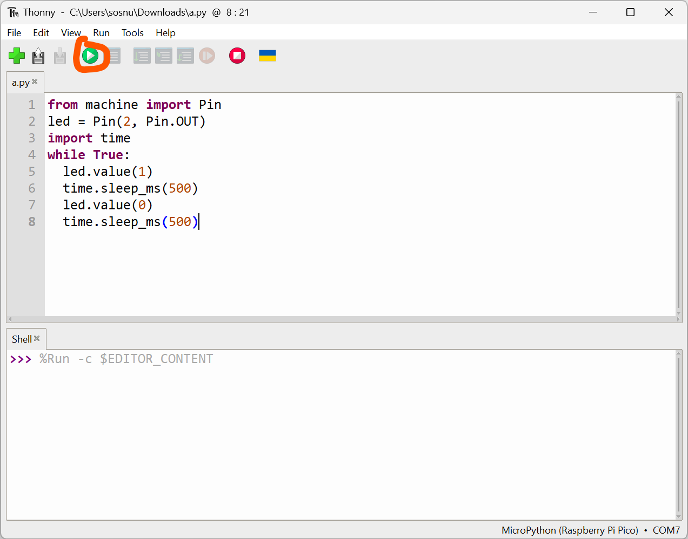

# Workshop
## Before You start
1. Do You have installed Thonny IDE (simplest way to develop project using Rpi Pico and Python)?
    * If not, follow this tutorial: https://projects.raspberrypi.org/en/projects/get-started-pico-w/0
2. Your Thonny IDE working with Rpi Pico W? You can deploy Your file written in Python to Pico W?
    * If not, follow this tutorial: https://projects.raspberrypi.org/en/projects/get-started-pico-w/1
3. Could You connect Rpi Pico to WiFI network?
    * If not, follow this tutorial: https://projects.raspberrypi.org/en/projects/get-started-pico-w/2 and ask about WiFI credentials

## First step with RPi Pico
### Install bootloader
Steps:
1. Run `Thonny IDE`

2. Plug in `RPi Pico WH`
3. Open `Tools`>`Options...`

4. Click `Install or update MicroPython`

5. Read instruction and select newest, stable version of bootloader

6. Click `Install`
7. After a lot of seconds we see label `Done`. Now we must close all windows of Thonny and back to main window of this IDE
8. Open `Tools`>`Options...` one more time - now You must see new Port COM on `Port` list:

9. Select this new port and press `OK`
10. If everything is OK, You must see in console this text:
```
MicroPython v1.20.0 on 2023-04-26; Raspberry Pi Pico W with RP2040

Type "help()" for more information.

>>> 
```
 

11. Now we can write first program. Click on `+` ("Plus") symbol on top left corner of IDE
12. Paste this snipet into editor:
```Python
from machine import Pin
led = Pin(2, Pin.OUT) # we use GP2, becouse it is first port on headers
import time 
while True: 
  led.value(1) 
  time.sleep_ms(500) 
  led.value(0) 
  time.sleep_ms(500)
```

13. And click `RUN` symbol:


### How to send data to Tago Core?

### How to read data from Tago Core?

#### Read data from Tago Core using Grafana


#### Read data from Tago Core using Rest API
https://help.tago.io/portal/en/kb/articles/36-getting-data
https://help.tago.io/portal/en/kb/articles/31-api-overview